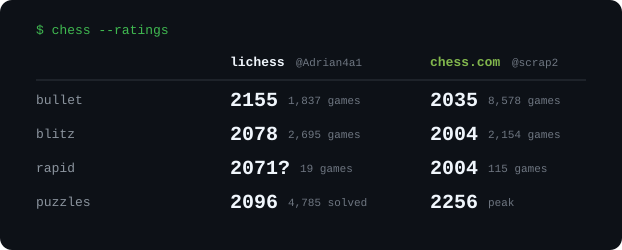

  

# Hi, I'm Adrian 👋

Junior at the **University of Chicago**. I like building systems that turn messy real-world signals into something you can actually reason about.

- ♟️ **Chess** — and teaching machines to talk about it
- 🤖 **AI / ML** — agents, fine-tuning, applied LLMs
- 🔐 **Cryptography**

---

### ♟️ Over the board

  

Updated daily by a GitHub Action · <a href="https://lichess.org/@/Adrian4a1">lichess</a> · <a href="https://www.chess.com/member/scrap2">chess.com</a>

---

### 🛠️ What I'm building

| Project | What it is |
|---|---|
| **[seaflow](https://github.com/Addaian/seaflow)** | Turns the public AIS radio feed into a vessel-level record of port calls, anchorage waits and chokepoint transits. Python, running on Kubernetes. |
| **[kibitz](https://github.com/Addaian/kibitz)** | An AI chess commentator — a fine-tuned LLM that narrates PGN games move by move. |
| **[pentesting](https://github.com/Addaian/pentesting)** | An agentic red-team simulator: a leader agent dispatches a swarm of probing and attack agents inside a sandboxed target. |
| **[fridge](https://fridge-dusky.vercel.app)** | A full-stack web app (TypeScript + Postgres), live on Vercel. |

---

### 📫 Reach me

---

### 📊 GitHub stats

